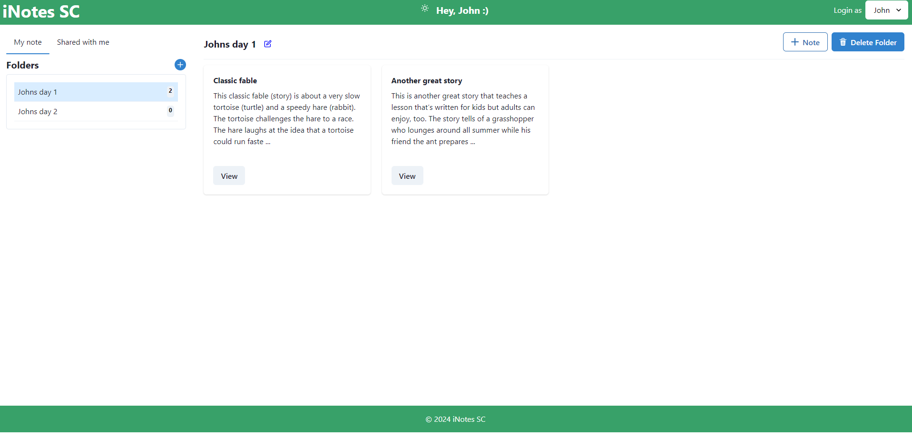
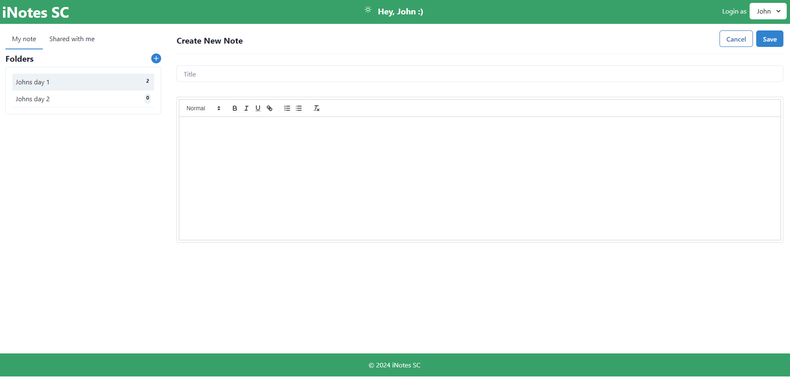
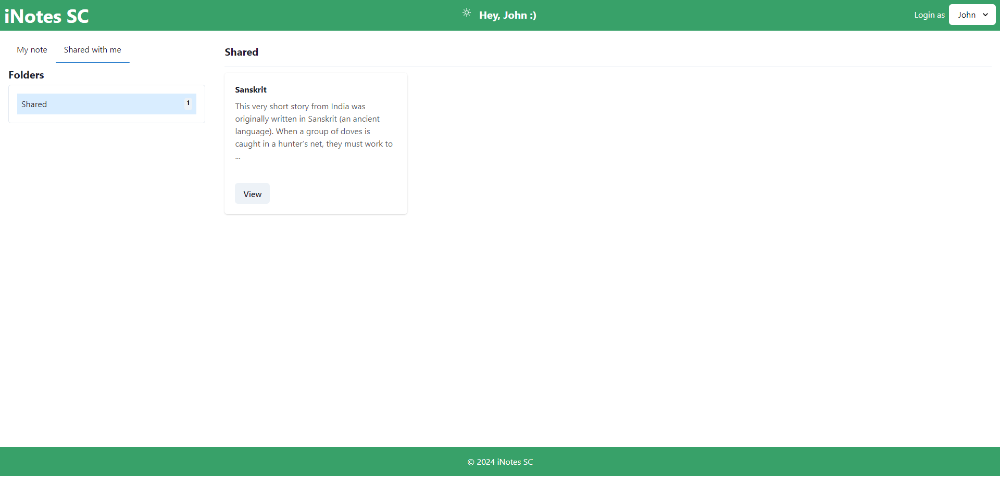

# iNote SC (Note Taking App)

A note-taking application built with React, TypeScript, Redux Toolkit, Chakra UI, and equipped with WYSIWYG editing, dummy user management using session-storage, and persistent notes storage using localstorage.

## Features

- **Folder Management**: Users can create and organize notes into folders.
- **WYSIWYG Editor**: Notes include a What You See Is What You Get (WYSIWYG) editor for rich text formatting.
- **Session Storage**: Toggle between dummy users (John, Amar, Priya) using session storage.
- **Persistent Notes**: Notes are stored in local storage for persistence across sessions.
- **Note Sharing**: Dummy users can share notes with each other, which will appear in the "Shared" folder section.

## Screenshots
**DEMO Link** : https://nitinmali.github.io/notes-app/

### Homepage

### WYSIWYG Editor

### Note Sharing

## Getting Started

### Prerequisites

- Node.js (v14 or higher)
- npm (v6 or higher)

## Application Overview

- **Folders**: Create folders to organize your notes. Use the "+" button to add new folders and drag notes into them.
- **Notes**: Use the WYSIWYG editor to write and format notes. You can add headings, bullet points, and more.
- **Session Storage**: Switch between dummy users to simulate different user experiences. Use the session storage toggle to switch between John, Amar, and Priya.

- **Local Storage**: Your notes are saved automatically in local storage, so they persist even after refreshing the page.

- **Sharing**: Share notes with other dummy users. Shared notes will be visible in the "Shared" folder.

## Technologies Used

- **React**: A JavaScript library for building user interfaces.
- **TypeScript**: A strongly typed programming language that builds on JavaScript.
- **Redux Toolkit**: A toolset for efficient Redux development.
- **Chakra UI**: A modular UI component library.
- **Local Storage & Session Storage**: For persistent and temporary storage needs.
- **Jest**: A JavaScript testing framework.
- **React Testing Library**: A library for testing React components.